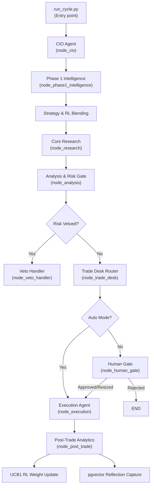

# AlphaDesk — AI Trading Cycle Architecture & Technical Guide

This document provides a comprehensive technical breakdown of how a complete AI trading cycle works in the **AlphaDesk** system. It describes the orchestrator flow, the agent communication patterns, the execution steps with code, and the reinforcement learning feedback loops.

---

## 1. System Orchestration & State Flow

AlphaDesk is structured as a state machine using **LangGraph**. The entire state of a trading run is captured by `TradingState` (defined in [schemas.py](file:///d:/trading-system/backend/core/schemas.py#L209)). Every node in the graph reads from, processes, and writes back updates to this shared context.



---

## 2. Step-by-Step Code Execution

### Phase 1: Cycle Initialization
The cycle is triggered from [run_cycle.py](file:///d:/trading-system/backend/run_cycle.py) using the `run_cycle` async task. It initializes the `TradingState` and executes the graph:

```python
# From backend/run_cycle.py
async def run_cycle(
    mode: str = "short_term",
    auto_mode: bool = False,
    watchlist: list[str] = None,
) -> dict:
    from graph.trading_graph import trading_graph
    from tools.broker import get_portfolio_snapshot
    import uuid

    # Generate a unique tracking UUID for this cycle run
    cycle_id = str(uuid.uuid4())

    # Fetch active assets to feed the agents
    portfolio = await get_portfolio_snapshot()

    initial_state = {
        "cycle_id": cycle_id,
        "mode": mode,
        "auto_mode": auto_mode,
        "mandate": {},
        "portfolio_snapshot": portfolio,
        "fundamentals": [],
        "quant_signals": [],
        "proposals": [],
        "technical_assessments": [],
        "risk_assessments": [],
        "compliance_flags": [],
        "errors": [],
        "final_status": "running",
        "past_similar_trades": [],
        "agent_reflections": {},
        "regime_history": [],
    }

    if watchlist:
        initial_state["mandate"]["watchlist"] = watchlist

    # Execute the LangGraph pipeline asynchronously
    result = await trading_graph.ainvoke(initial_state)
    return result
```

---

### Phase 2: High-Level Direction (The CIO Agent)
The `cio` node is the first node in [trading_graph.py](file:///d:/trading-system/backend/graph/trading_graph.py). It invokes [cio.py](file:///d:/trading-system/backend/agents/cio.py#L38):

```python
# From backend/agents/cio.py
async def run(self, state: dict, conn: asyncpg.Connection) -> dict:
    mode     = state.get("mode", "short_term")
    cycle_id = state.get("cycle_id", str(uuid4()))
    market   = state.get("market", "us")

    # Load long-term memory context (e.g., past regime occurrences)
    past_regimes = await get_portfolio_context(conn)
    reflections  = await self.recall(
        conn,
        f"investment mandate {mode} trading strategy",
        memory_types=["reflection"],
        limit=4,
    )
    memory_context = self._format_memories(past_regimes + reflections)

    # Compile any Phase 1 signals if running in an iterative cycle loop
    p1_summary = self._summarise_phase1(...)

    user_msg = f"""
    Current mode:     {mode.upper()}
    Market:           {market.upper()}
    Past reflections:
    {memory_context}
    """

    # Request the structured mandate guidelines from the LLM
    mandate_data = await self.think_json(SYSTEM_PROMPT, user_msg)
    
    # Store the CIO mandate choice as semantic memory for future runs
    await self.remember(
        conn, "analysis",
        f"CIO mandate [{market}/{mode}]: theme='{mandate_data.get('theme')}'",
        metadata=mandate_data,
        cycle_id=cycle_id,
        importance=0.65,
    )

    return {
        "cycle_id":  cycle_id,
        "mandate":   mandate_data,
        "research_done": False,
        "risk_veto":     False,
        "awaiting_human": False,
        "proposals":  [],
    }
```

---

### Phase 3: Parallel Environmental Scan (Phase 1 Agents)
In `node_phase1_intelligence`, four market intelligence agents execute simultaneously using Python's `asyncio.gather`.

```python
# From backend/graph/trading_graph.py
async def node_phase1_intelligence(state: TradingState) -> TradingState:
    logger.info("node_phase1_start")
    # 1. Async Fan-Out: Run news, macro indicators, options sweeps, and calendar dates with separate connections
    results = await asyncio.gather(
        _run_agent_with_own_conn(news_sentiment, state),
        _run_agent_with_own_conn(macro_intel_ag, state),
        _run_agent_with_own_conn(options_flow, state),
        _run_agent_with_own_conn(earnings_calendar, state),
        return_exceptions=True,
    )
    for r in results:
        if not isinstance(r, Exception):
            state.update(r)

    # 2. Strategy Library Selection based on parsed Macro Regime
    macro_regime  = state.get("macro_intel", {}).get("macro_regime", "NEUTRAL")
    mode          = state.get("mode", "short_term")
    market        = state.get("market", "us")

    strategy = select_strategy(macro_regime, mode, market)
    state["mandate"] = apply_strategy_to_mandate(state.get("mandate", {}), strategy)
    state["active_strategy"] = strategy.name

    # 3. Fetch RL weights & blend them into Strategy Weights (70% Strategy, 30% RL)
    try:
        optimiser = RLWeightOptimiser()
        conn = await get_raw_connection()
        try:
            rl_weights = await optimiser.get_weights(conn, market)
        finally:
            await conn.close()
        current_weights = state["mandate"].get("agent_weights", {})
        
        blended = {}
        all_keys = set(list(current_weights.keys()) + list(rl_weights.keys()))
        for k in all_keys:
            blended[k] = 0.70 * current_weights.get(k, 0) + 0.30 * rl_weights.get(k, 0)
        
        total = sum(blended.values()) or 1
        state["mandate"]["agent_weights"] = {k: v/total for k, v in blended.items()}
        state["rl_weights"] = rl_weights
    except Exception as e:
        logger.warning("rl_weights_load_failed", error=str(e))

    return state
```

---

### Phase 4: Sizing & Trade Proposal Formulation
The Portfolio Strategist ([strategist.py](file:///d:/trading-system/backend/agents/strategist.py)) compiles the fundamental, quantitative, and market signals and applies weights to generate trade sizes:

```python
# From backend/agents/strategist.py
async def run(self, state: dict, conn: asyncpg.Connection) -> dict:
    mandate = state.get("mandate", {})
    market_intel = state.get("market_intel", {})
    fundamentals = state.get("fundamentals", [])
    quant_signals = state.get("quant_signals", [])
    agent_weights = mandate.get("agent_weights", {})

    user_msg = f"""
    Risk budget: {mandate.get('risk_budget', 4.0)}% VaR
    Agent weights: {json.dumps(agent_weights)}
    Market Intel: {json.dumps(market_intel)}
    Fundamentals: {json.dumps(fundamentals)}
    Quant signals: {json.dumps(quant_signals)}
    """
    
    # Request synthesis into structured proposals from LLM
    proposals_raw = await self.think_json(SYSTEM_PROMPT, user_msg)
    proposals = proposals_raw.get("proposals", proposals_raw) if isinstance(proposals_raw, dict) else proposals_raw

    # Assign cycle tracking variables to proposals
    for p in proposals:
        p["cycle_id"] = state.get("cycle_id")
        p["sender"] = "portfolio_strategist"

    await self.remember(
        conn, "analysis",
        f"Proposed {len(proposals)} trades: " + ", ".join(p.get("symbol") for p in proposals),
        metadata={"proposals": proposals},
        cycle_id=state.get("cycle_id")
    )
    return {"proposals": proposals}
```

---

### Phase 5: Safeguard and Risk Checks (The Risk Manager)
The Risk Manager ([risk_manager.py](file:///d:/trading-system/backend/agents/risk_manager.py)) receives the proposals alongside current portfolio weights and technical indicator bounds. It retains **veto** capabilities.

```python
# From backend/agents/risk_manager.py
async def run(self, state: dict, conn: asyncpg.Connection) -> dict:
    proposals = state.get("proposals", [])
    technical_assessments = state.get("technical_assessments", [])
    portfolio_snapshot = state.get("portfolio_snapshot", {})
    risk_budget = state.get("mandate", {}).get("risk_budget", 4.0)

    tech_map = {t.get("symbol"): t for t in technical_assessments}
    assessments = []
    any_approved = False

    for proposal in proposals:
        symbol = proposal.get("symbol")
        technical = tech_map.get(symbol, {})

        user_msg = f"""
        Risk budget (max VaR %): {risk_budget}
        Trade proposal: {json.dumps(proposal)}
        Technical assessment: {json.dumps(technical)}
        Current portfolio: {json.dumps(portfolio_snapshot)}
        """

        # Perform risk checks (drawdown headroom, sector concentration)
        assessment = await self.think_json(SYSTEM_PROMPT, user_msg)
        assessment["cycle_id"] = state.get("cycle_id")
        assessment["sender"] = "risk_manager"

        if assessment.get("decision") in ("approved", "approved_resized"):
            any_approved = True

        await self.remember(
            conn, "analysis",
            f"Risk assessment {symbol}: {assessment.get('decision')}",
            metadata=assessment,
            cycle_id=state.get("cycle_id")
        )
        assessments.append(assessment)

    # Set risk_veto to True if all trades are rejected, halting execution
    risk_veto = not any_approved
    return {
        "risk_assessments": assessments,
        "risk_veto": risk_veto,
    }
```

---

### Phase 6: Routing Decisions
The LangGraph workflow routes state progress dynamically based on decisions using routing functions:

```python
# From backend/graph/trading_graph.py
def route_after_risk(state: TradingState) -> Literal["trade_desk", "veto_handler"]:
    # Veto handler updates database state to "rejected" immediately
    return "veto_handler" if state.get("risk_veto") else "trade_desk"

def route_after_human_gate(state: TradingState) -> Literal["execution", "end_rejected", "wait_human"]:
    if state.get("auto_mode"):
        return "execution"
        
    hd = state.get("human_decision", {})
    if not hd:
        return "wait_human" # Enters wait loop state on Dashboard UI
        
    decision = hd.get("decision")
    if decision in ("approved", "resized"):
        return "execution"
    if decision == "rejected":
        return "end_rejected"
    return "wait_human"
```

---

### Phase 7: Post-Trade Learning (UCB1 RL weight optimization)
When a trade is completed and closed, `trigger_rl_update` (defined in [rl_optimiser.py](file:///d:/trading-system/backend/strategies/rl_optimiser.py#L232)) is fired.

```python
# From backend/strategies/rl_optimiser.py
def _calculate_reward(self, outcome: dict) -> float:
    pnl_pct = float(outcome.get("pnl_pct", 0) or 0)
    hold    = max(int(outcome.get("hold_days", 1) or 1), 1)
    vol     = float(outcome.get("entry_volatility", 0.02) or 0.02)

    # Calculate Sharpe-adjusted returns per day
    daily_return = pnl_pct / 100 / hold
    reward = (daily_return - RISK_FREE_RATE_DAILY) / vol
    return max(-3.0, min(3.0, reward))

async def _recalculate_ucb1(self, conn: asyncpg.Connection, market: str) -> dict[str, float]:
    rows = await conn.fetch("SELECT signal_key, total_reward, pull_count FROM rl_signal_weights WHERE market = $1", market)
    total_pulls = sum(r["pull_count"] for r in rows) or 1
    C = 0.5 # Exploration factor constant

    ucb_scores = {}
    for r in rows:
        key    = r["signal_key"]
        pulls  = max(r["pull_count"], 1)
        avg_r  = r["total_reward"] / pulls
        
        # UCB1 Exploration Formula
        bonus  = C * math.sqrt(math.log(total_pulls) / pulls)
        ucb_scores[key] = avg_r + bonus

    # Shift scores, normalize and apply min/max boundaries
    weights = self._normalise(ucb_scores)
    weights = {k: max(MIN_WEIGHT, min(MAX_WEIGHT, v)) for k, v in weights.items()}
    weights = self._normalise(weights)

    # Update database table weights
    for key, w in weights.items():
        await conn.execute("UPDATE rl_signal_weights SET weight = $1 WHERE signal_key = $2 AND market = $3", w, key, market)

    return weights
```

---

## 3. The Semantic Long-Term Memory (pgvector)

Each agent extends from `BaseAgent` ([base.py](file:///d:/trading-system/backend/agents/base.py)), which integrates pgvector queries for semantic search and storage:

```python
# From backend/core/memory.py
async def write_memory(
    conn: asyncpg.Connection,
    agent_id: str,
    memory_type: str,
    content: str,
    metadata: dict = None,
    importance_score: float = 0.5,
) -> str:
    # 1. Embed text using the active LLM provider (Gemini / OpenAI / Claude)
    embedding = await embed(content)
    embedding_str = "[" + ",".join(str(x) for x in embedding) + "]"

    memory_id = str(uuid.uuid4())
    # 2. Insert embedding into pgvector vector column
    await conn.execute("""
        INSERT INTO agent_memories (id, agent_id, memory_type, content, embedding, importance_score, metadata)
        VALUES ($1::uuid, $2, $3, $4, $5::vector, $6, $7)
    """, memory_id, agent_id, memory_type, content, embedding_str, importance_score, json.dumps(metadata or {}))
    return memory_id

async def retrieve_memories(
    conn: asyncpg.Connection,
    agent_id: str,
    query: str,
    limit: int = 8,
) -> list[dict]:
    # 1. Embed query
    embedding = await embed(query)
    embedding_str = "[" + ",".join(str(x) for x in embedding) + "]"

    # 2. Query using cosine distance operator (<=>)
    rows = await conn.fetch("""
        SELECT id::text, content, memory_type, 1 - (embedding <=> $3::vector) AS similarity
        FROM agent_memories
        WHERE agent_id = $1
        ORDER BY embedding <=> $3::vector
        LIMIT $4
    """, agent_id, ["observation", "reflection"], embedding_str, limit)
    return [dict(r) for r in rows]
```
> [!NOTE]
> Cosine distance `embedding <=> query` computes spatial mismatch. Subtracting this metric from 1 computes the similarity score.
